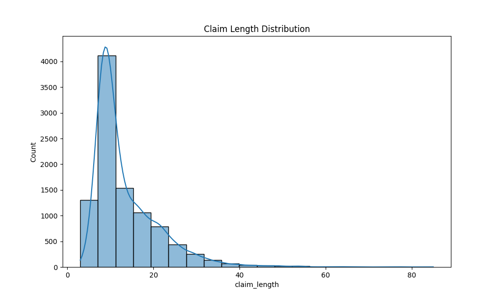
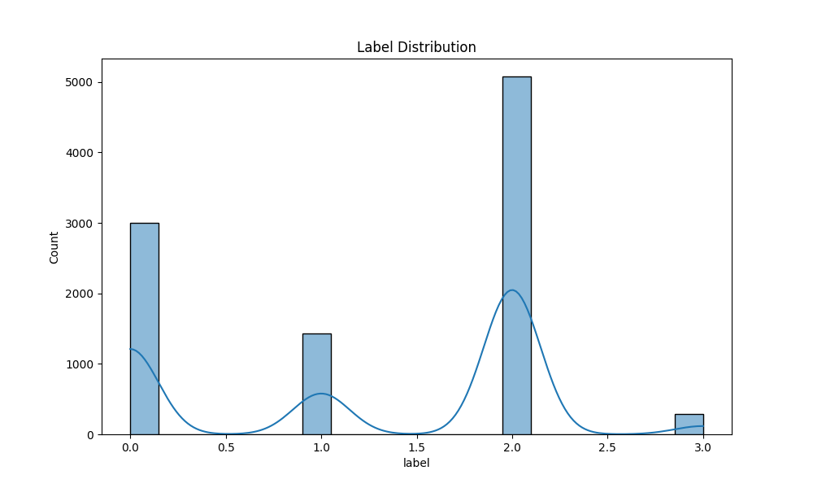
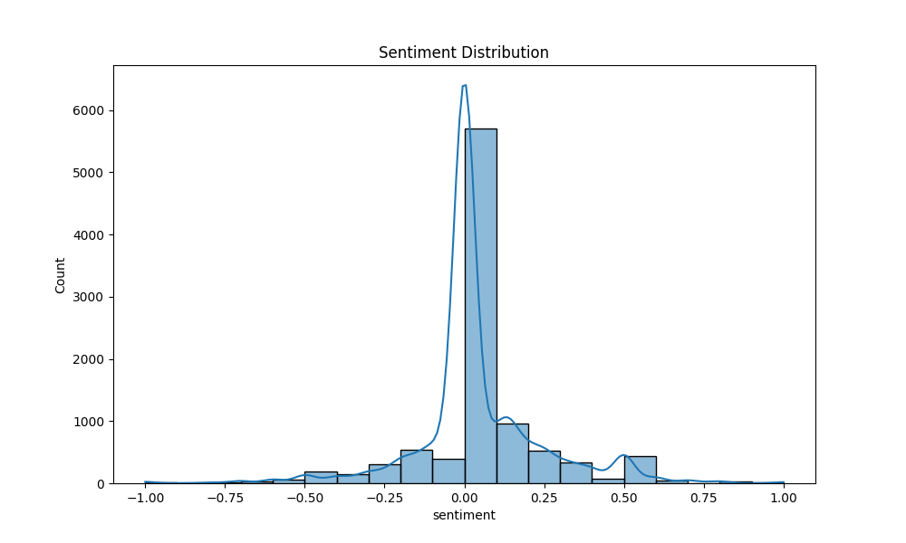
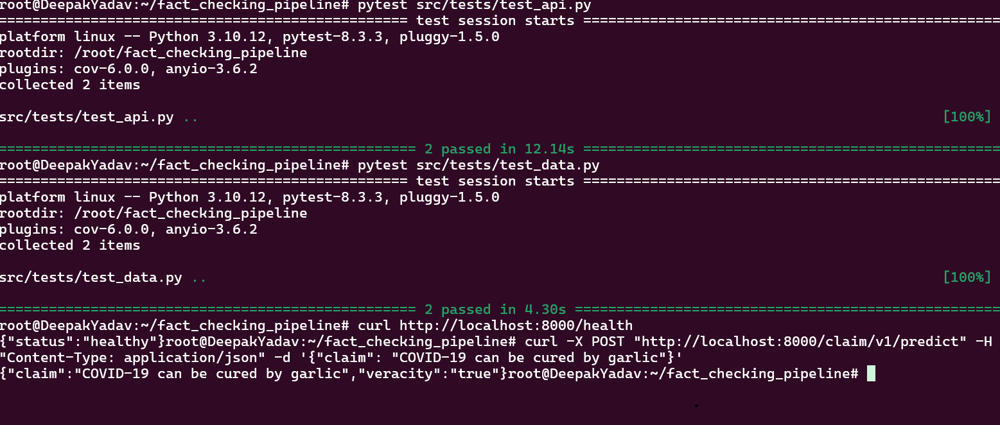
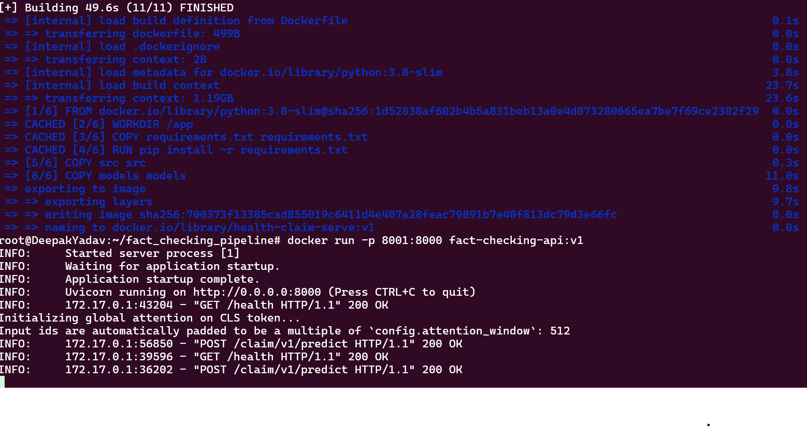
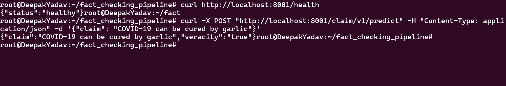

# Project Overview
The Health Claim Veracity Prediction API is a robust machine learning system designed to verify the accuracy of health-related claims. This project aims to address the growing prevalence of misinformation, particularly in the health sector. By leveraging advanced Natural Language Processing (NLP) models, the API evaluates the veracity of a given health claim and classifies it into categories such as “True,” “False,” “Mixture,” or “Unproven.” The API is structured to be highly scalable, containerized using Docker, and deployable on Kubernetes, enabling reliable performance and ease of integration into various applications.

# Objective
The objective of this project is to build an end-to-end MLOps pipeline for a public health claim verification service. This includes data ingestion, model training, API creation, and deployment in a scalable environment, with monitoring and retraining capabilities.

## Pipeline Overview

The pipeline comprises the following stages:
- Data Collection
- Data Processing
- Model Selection
- Training, Evaluation, and Optimization
- Deployment
- Monitoring and Updates

## Requirements
```bash
pip install -r requirements.txt
```

### 1. Data Collection
The dataset used for this project is health-related claim data from publicly available resources. processed to ensure consistency, relevance, and suitability for model training. Key preprocessing steps include:

   - Text normalization, tokenization, and stop-word removal.
   - Creation of training, validation, and test datasets.
   - Exploration of feature engineering techniques to enhance model inputs.

**Script:** `ingest.py`  
This script downloads the data and saves it in a user-defined folder (default is `data/`). The following command demonstrates how to run the script:

```bash
python ingest.py --output_dir data/
```

### 2. Data Processing
After data collection, the next step is to process it for model training. This step involves cleaning, tokenizing, and formatting the data for compatibility with transformer models.

**Script:** `prepare.py`  
This script processes the ingested data, saving the output in a format ready for training.

```bash
python prepare.py --input_dir data/ --output_dir processed_data/
```

### 3. Exploratory Data Analysis (EDA)
EDA provides insights into the data distribution, helping identify patterns, anomalies, and potential areas for feature engineering. Below are some visualizations derived during the EDA phase:
- Class Length Distribution
- Claim Length Distribution
- Sentiment Level





### 4. Model Selection
For this task, we explored several pre-trained models fine-tuned for health claim veracity prediction on Hugging Face, including:
- DistilBERT - Fine-tuned for health claims
- Longformer - Health Fact
- BigBird - Health Fact

**Model Comparison:**
- **Longformer:** Handles longer text sequences, suitable for verbose health claims. However, it is resource-intensive.
- **BigBird:** Optimized for long sequences but with higher memory requirements.
- **DistilBERT:** More lightweight and faster due to model distillation, offering a balanced performance for typical health claim lengths.

Analysed the resources, DistilBERT was selected for its balance between performance and efficiency. As it is already trained on health fact datasets easy to capure contextual features and improve more by doing finetuing.

**Fine-Tuning DistilBERT**  
We fine-tuned DistilBERT on health-related claims data, training for 10 epochs due to CPU constraints. The main hyperparameters used include:
- Batch Size: 16
- Learning Rate: 3e-5
- Epochs: 10
- Optimizer: AdamW

Increasing epochs, batch size, and adjusting the learning rate could improve accuracy further.

### 5. Training, Evaluation, and Optimization
The `train.py` script fine-tunes the selected model. Relevant hyperparameters like epochs, batch size, and learning rate are exposed for tuning.

**Script:** `train.py`
```bash
python train.py --input_dir processed_data/ --output_dir model_output/ --epochs 10 --batch_size 16 --learning_rate 1e-5
```

**Evaluation and Optimization**  
The model was evaluated using accuracy, precision, recall, and F1 score. Future optimization could involve hyperparameter tuning with Grid Search or Bayesian Optimization.

**Example Training Output**  
```
INFO:root:Starting MLFlow run...
INFO:root:Training the model...
  0% 0/100 [00:00<?, ?it/s]Initializing global attention on CLS token...
We strongly recommend passing in an `attention_mask` since your input_ids may be padded. See https://huggingface.co/docs/transformers/troubleshooting#incorrect-output-when-padding-tokens-arent-masked.
Input ids are automatically padded to be a multiple of `config.attention_window`: 512
{'loss': 1.1154, 'grad_norm': 16.997333526611328, 'learning_rate': 9.100000000000001e-06, 'epoch': 0.07}
{'loss': 0.9356, 'grad_norm': 16.469404220581055, 'learning_rate': 8.2e-06, 'epoch': 0.13}
{'loss': 0.9465, 'grad_norm': 18.101322174072266, 'learning_rate': 7.2000000000000005e-06, 'epoch': 0.2}
{'loss': 0.9184, 'grad_norm': 16.20439910888672, 'learning_rate': 6.200000000000001e-06, 'epoch': 0.26}
{'loss': 0.9456, 'grad_norm': 16.226097106933594, 'learning_rate': 5.2e-06, 'epoch': 0.33}
{'loss': 0.8968, 'grad_norm': 23.145723342895508, 'learning_rate': 4.2000000000000004e-06, 'epoch': 0.39}
{'loss': 0.8416, 'grad_norm': 20.199142456054688, 'learning_rate': 3.2000000000000003e-06, 'epoch': 0.46}
{'loss': 0.9286, 'grad_norm': 19.191715240478516, 'learning_rate': 2.2e-06, 'epoch': 0.52}
{'loss': 0.8609, 'grad_norm': 13.251740455627441, 'learning_rate': 1.2000000000000002e-06, 'epoch': 0.59}
{'loss': 0.87, 'grad_norm': 13.024718284606934, 'learning_rate': 2.0000000000000002e-07, 'epoch': 0.65}
100% 100/100 [11:04<00:00,  6.60s/it]
.
.
.
.

 99% 151/152 [00:43<00:00,  3.49it/s]
                                     
{'eval_loss': 0.8800051808357239, 'eval_accuracy': 0.6474464579901154, 'eval_f1': 0.596052392539883, 'eval_runtime': 44.1078, 'eval_samples_per_second': 27.524, 'eval_steps_per_second': 3.446, 'epoch': 0.65}
100% 100/100 [11:58<00:00,  6.60s/it]
100% 152/152 [00:43<00:00,  3.68it/s]
{'train_runtime': 738.577, 'train_samples_per_second': 8.665, 'train_steps_per_second': 0.135, 'train_loss': 0.9259439849853516, 'epoch': 0.65}
100% 100/100 [12:18<00:00,  7.39s/it]
INFO:root:Evaluating the model...
100% 152/152 [00:44<00:00,  3.39it/s]
INFO:root:Saving the model and tokenizer to models...
INFO:root:Training completed and MLFlow run ended.

...
```

### 6. Deployment
The API is deployed as a FastAPI application running in a Docker container. It exposes an endpoint, `/claim/v1/predict`, for veracity prediction of health claims.

**Script:** `serve.py`  
The FastAPI application can be started locally with the following command:

```bash
uvicorn src.serve:app --host 0.0.0.0 --port 8000
```
Output :

```
INFO:     Started server process [15356]
INFO:     Waiting for application startup.
INFO:     Application startup complete.
INFO:     Uvicorn running on http://0.0.0.0:8000 (Press CTRL+C to quit)

```

---

To run the API tests using pytest, you can use the following command. This will execute the tests for the API endpoints to ensure everything is functioning as expected.

## Run Pytest for API Testing
Make sure your FastAPI server is running (e.g., with uvicorn or in Docker), then run:


```bash

pytest src/tests/test_api.py
```
        
```output
======================================= test session starts ========================================
platform linux -- Python 3.10.12, pytest-7.4.4, pluggy-1.5.0
rootdir: /content/fact_checking_pipeline
plugins: cov-6.0.0, anyio-3.7.1, typeguard-4.4.0
collected 6 items                                                                                  

src/tests/test_api.py ..                                                                     [ 33%]
src/tests/test_data.py ..                                                                    [ 66%]
src/tests/test_model.py ..                                                                   [100%]

========================================= warnings summary =========================================
src/tests/test_model.py::test_model_inference
  /usr/local/lib/python3.10/dist-packages/transformers/tokenization_utils_base.py:1601: FutureWarning: `clean_up_tokenization_spaces` was not set. It will be set to `True` by default. This behavior will be depracted in transformers v4.45, and will be then set to `False` by default. For more details check this issue: https://github.com/huggingface/transformers/issues/31884
    warnings.warn(

-- Docs: https://docs.pytest.org/en/stable/how-to/capture-warnings.html
=================================== 6 passed, 1 warning in 8.86s ===================================

```



---

## Docker setup for containerized deployment can be built and run with

**Docker Deployment**  
The Docker setup for containerized deployment can be built and run with:

```bash
docker build -t health-claim-serve:v1 .
docker run -p 8000:80 health-claim-serve:v1
```





---

**Kubernetes Deployment (Optional)**  
The Kubernetes configuration can deploy the Dockerized application in a cluster.

**API Usage**
The following endpoints are exposed by the FastAPI application.

- **Health Check Endpoint**
  ```bash
  curl http://localhost:8000/health
  ```
  **Response:**
  ```json
  {"status": "healthy"}
  ```

- **Prediction Endpoint**
  ```bash
  curl -X POST "http://localhost:8000/claim/v1/predict" -H "Content-Type: application/json" -d '{"claim": "COVID-19 can be cured by garlic"}'
  ```
  **Example Response:**
  ```json
  {
      "claim": "COVID-19 can be cured by garlic",
      "veracity": "false"
  }
  ```

---     
### 7. Monitoring and Updates
Monitoring is essential for maintaining model accuracy. We suggest the following methods for monitoring and updating the model:
- **Performance Metrics:** Track metrics such as response time, accuracy, and error rate.
- **Logging:** Log requests and responses to analyze misclassifications.
- **Data Drift Detection:** Implement checks to detect when the input data distribution deviates significantly from the training data.
- **Retraining Strategy:** Set thresholds for model performance metrics, initiating retraining when metrics degrade or drift is detected.


---

## **Note on Model File**
Due to the large size of the trained model file, it cannot be pushed directly to GitHub. The model file is available for download via this [Google Drive link](https://drive.google.com/file/d/1vWkYo78qnf3Ae4cjfdiYXSTfJMyHFQnW/view?usp=sharing) .

To run the API endpoint: Please download the model file and place it in the models folder before running the application. This will ensure that the endpoint is functional and can process predictions

---

## Conclusion
This project demonstrates a complete pipeline for deploying a health claim fact-checking model, covering data collection, processing, model selection, training, deployment, and monitoring. The modular code allows for further enhancements and fine-tuning to improve model accuracy and scalability.

